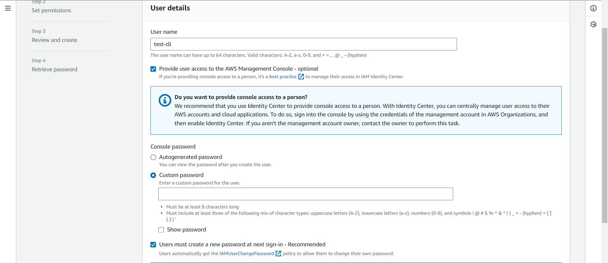
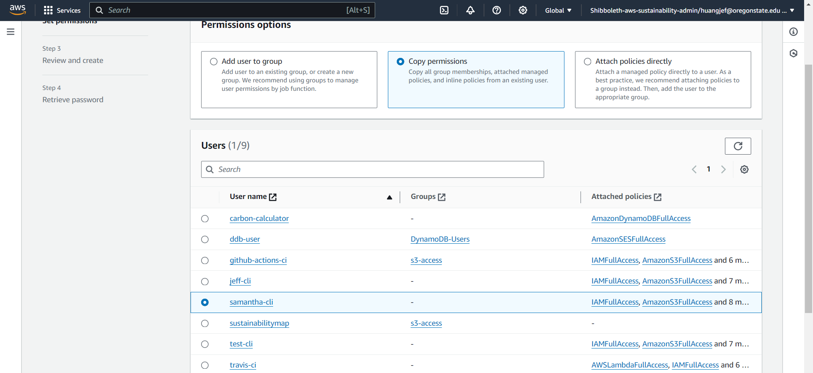
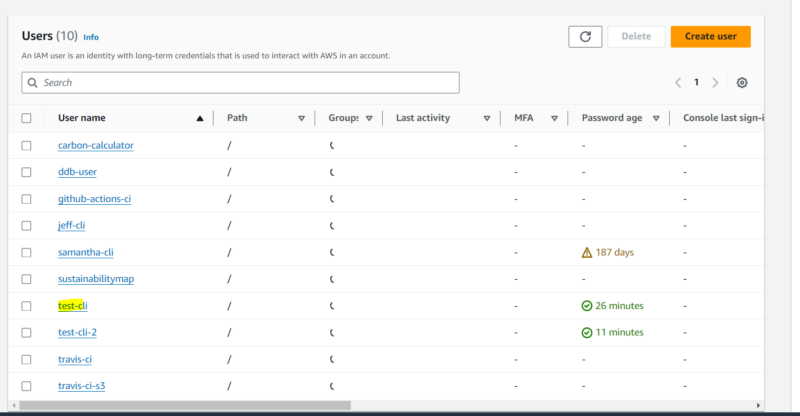
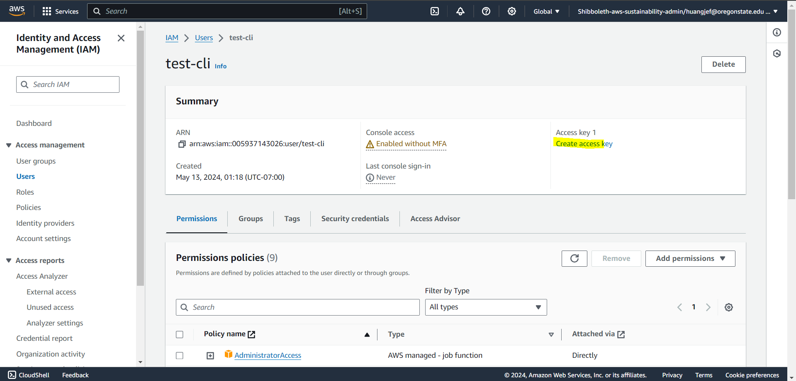
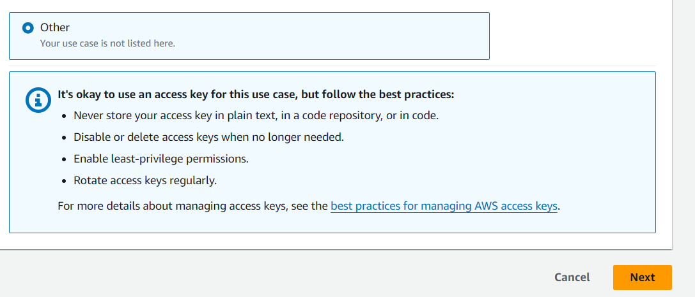
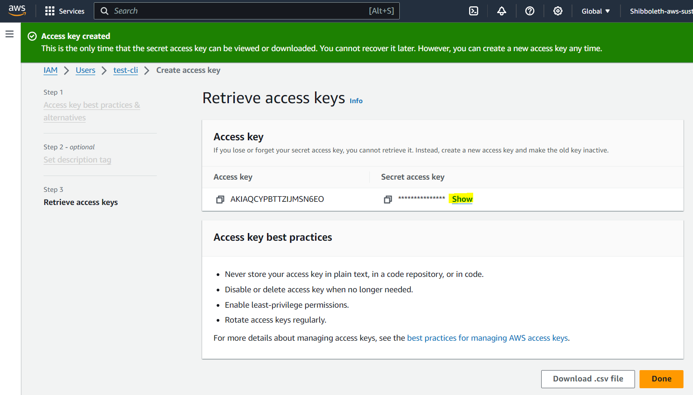
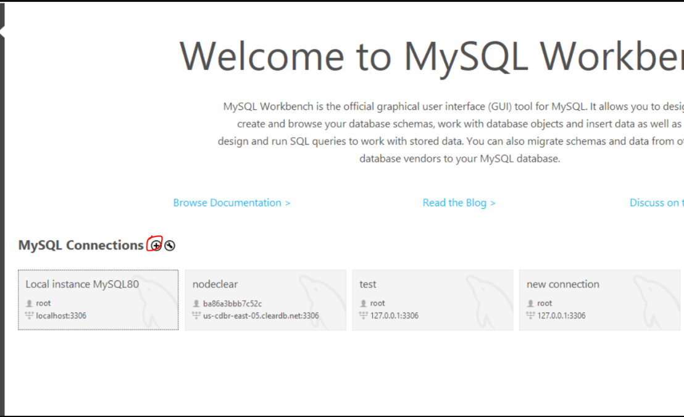
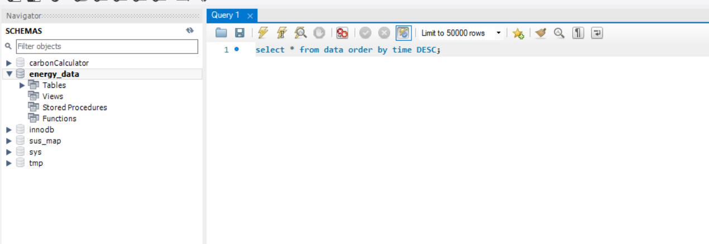

# Backend Pre-Reqs

## General Software Needed

### Docker

- Docker & Docker Compose (for local backend testing):
  - [https://docs.docker.com/engine/install/](https://docs.docker.com/engine/install/)
  - Select “Docker Desktop for &lt;Your Platform>”

### NPM

- NPM: [https://docs.npmjs.com/downloading-and-installing-node-js-and-npm](https://docs.npmjs.com/downloading-and-installing-node-js-and-npm)
  - You probably have this but just in case

### Yarn

We use Yarn for this wiki. Run this _after_ you have set up npm. You may have to re-run this if you switch NodeJS versions with NVM as listed below.

- `npm install --global yarn`
- https://classic.yarnpkg.com/lang/en/docs/install/#windows-stable

### NVM / NodeJS

- Node Version Manager (nvm):
  - This isn’t required but I highly recommend it (very annoying to switch NodeJS versions otherwise).
  - **This one is for Apple / Linux**: [https://github.com/nvm-sh/nvm](https://github.com/nvm-sh/nvm)
  - **Use this one for Windows**: [https://github.com/coreybutler/nvm-windows](https://github.com/coreybutler/nvm-windows)
    - Make sure to uninstall existing Node installation just in case: [https://github.com/coreybutler/nvm-windows#installation--upgrades](https://github.com/coreybutler/nvm-windows#installation--upgrades)
    - Read instructions in the repo README for general tips on installing specific node versions.
  - Use Node 18 ( `nvm use 18 `)

### AWS

- AWS Stuff - **Do each step below in order. AWS CLI, SAM CLI can be installed but can’t set up credentials until OSU IT sets up your account.**

  - **Disclaimer**: Some of the below instructions may no longer be 100% accurate in the future **(last updated May 2024)**, as AWS is known to update their policies and web console UI periodically
    - If in doubt, check the **[official AWS IAM docs](https://docs.aws.amazon.com/IAM/latest/UserGuide/getting-started.html)**
  - Login (some links below will fail if not logged in): [https://login.oregonstate.edu/apps/aws/](https://login.oregonstate.edu/apps/aws/)
    - If you haven't gotten your AWS account set up yet, contact a current Sustainability Office Software Intern about this, or else reach out directly to OSU IT at leanne@engr.oregonstate.edu
  - IAM (set up authorized user account): [https://us-east-1.console.aws.amazon.com/iamv2/home?region=us-east-1#/users](https://us-east-1.console.aws.amazon.com/iamv2/home?region=us-east-1#/users)
    - Click “Add User” to begin
    - On Step 1, enter a name for your new IAM user with the format "myname-cli" (substituting your actual name for "myname"). Check the checkboxes for "Provide user access to the AWS Management Console" and then set up your IAM user's password
      - 
    - On Step 2, select “Copy permissions” > copy from an existing user whose name ends with "-cli", e.g. "samantha-cli"
      - 
    - On Step 3, review and then click "Create User" button
    - On Step 4, view your password if you haven't already, and then click "Return to users list"
  - IAM (get access key ID)

    - Back to the Users List page, click on the user you just created ("yourname.cli"), then click on "Create access key"
      - 
      - 
    - On Step 1 (next page), click "Other", then next
      - 
    - On Step 2, enter a name for your access key if you want (optional), then "Create access key" button
    - On Step 3, you will see the login details of your user. Click “Show” on Secret Access key.

    :::caution

    Make sure to save both your Access Key ID and Secret Access Key in txt file etc. locally, **you will not be able to see the Secret Access key again.**

    :::

    - 

  - AWS CLI (for verifying AWS credentials):
    - Installation: [https://docs.aws.amazon.com/cli/latest/userguide/getting-started-install.html](https://docs.aws.amazon.com/cli/latest/userguide/getting-started-install.html)
    - Configuration Documentation: [https://docs.aws.amazon.com/cli/latest/userguide/getting-started-quickstart.html](https://docs.aws.amazon.com/cli/latest/userguide/getting-started-quickstart.html)
    - Run `aws configure` in the command line after installation.
    - Fill in all details (refer to IAM section for Access Key ID and Secret Access Key). Make sure to select “us-west-2” for region. I think default output can be left as json.
  - AWS SAM CLI (CLI for serverless backend):
    - [https://docs.aws.amazon.com/serverless-application-model/latest/developerguide/install-sam-cli.html](https://docs.aws.amazon.com/serverless-application-model/latest/developerguide/install-sam-cli.html)

### IDE

- IDE: Use any you like, VSCode is a personal favorite of mine.
  - For VSCode install appropriate extensions for Vue, Javascript, etc

### MySQL Workbench

- MySQL Workbench (for debugging database. Probably won’t need this right now tbh but good to set up.)
  - Installation: [https://www.mysql.com/products/workbench/](https://www.mysql.com/products/workbench/)
  - New Connection (Click Plus Sign): 
  - [For MySQL credentials, see here](https://drive.google.com/file/d/1dY-t3bxLc3HRkjg2HDr6uyvcM3BIYKW0/view?usp=sharing)
    - Need to be paid employee of OSU Sustainability office to see above link
  - Once set up:
    - Open connection, select “energy_data” from schemas in left
    - Limit to 50,000 rows to avoid it taking too long.
    - Run test query, e.g. `select * from data order by time DESC;`
    - Click the lightning symbol to run query.
    - 

## General Documentation

- AWS SAM: [https://docs.aws.amazon.com/serverless-application-model/latest/developerguide/what-is-sam.html](https://docs.aws.amazon.com/serverless-application-model/latest/developerguide/what-is-sam.html)
- Vue2: [https://v2.vuejs.org/](https://v2.vuejs.org/)
  - We may migrate to Vue3 at some point but not yet. Most Vue tutorials out there are now in Vue3, so just keep in mind there are some differences in Vue2.
- Vuex / Vue Store: [https://vuex.vuejs.org/](https://vuex.vuejs.org/)
  - You do not need to separately install Vue or Vue Cli per se, they are included in the package.json of the project. However, separately installing them could be good for learning on your own when following tutorials.
- Github Actions (CI / devops): [https://docs.github.com/en/actions](https://docs.github.com/en/actions)
- Other backend stuff (skip to page 8 or so. I don’t understand this that well so just read original doc): [https://docs.google.com/document/d/195yG472A_xzk53GmmxTIP2i8sS-c8QN4v-5lk4XyaZ4/edit](https://docs.google.com/document/d/195yG472A_xzk53GmmxTIP2i8sS-c8QN4v-5lk4XyaZ4/edit)

## Get Project Running Locally

Start up the Docker Desktop (backend won’t work locally otherwise).

Open two terminal instances (or split one terminal into two panes), navigate to project directory in each.

In terminal one:

`cd backend`

`npm install` (first time only)

`sam local start-api`

In terminal two:

`npm install` (first time only)

`npm run serve`

Backend is locally hosted at [http://localhost:3000](http://localhost:3000)

Frontend is locally hosted at [http://localhost:8080](http://localhost:8080)

NOTE: Need both backend and frontend running for it to work.

## Current Issues

Check shared google drive:

- Software meeting notes: [https://docs.google.com/document/d/1VWoR9N4KLWHiKGyriwc2NTm5cVSIw9JZa0z5jcgCBM0/edit](https://docs.google.com/document/d/1VWoR9N4KLWHiKGyriwc2NTm5cVSIw9JZa0z5jcgCBM0/edit)
- Software Timeline: [https://docs.google.com/document/d/1yCgnyXrtE-75l5tZCuh2obDY993uQUMY5euhmTOXE3s/edit](https://docs.google.com/document/d/1yCgnyXrtE-75l5tZCuh2obDY993uQUMY5euhmTOXE3s/edit)
- Github: [https://github.com/OSU-Sustainability-Office](https://github.com/OSU-Sustainability-Office)
  - Click on a repository, then Issues.
  - Currently Energy Dashboard, automated-jobs (private repo, need to add you to org), lambda-common-layer are actively being worked on.
  - Tell me your username on Github so I can add you to the organization.
