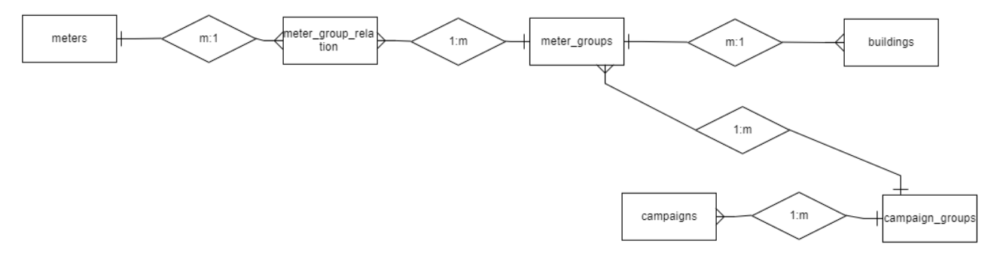

- **DO NOT** run any commands here blindly in the MySQL Workbench. Edit to fit your needs, checking you have set correct parameters

## General Tips

- For MySQL Workbench, I like using the commands:
  - `SELECT` for viewing database tables
  - `INSERT INTO` for adding elements
  - `UPDATE` for editing tables
  - `DELETE` for deleting table elements
- Remember for general syntax:
  - Database or column etc names should use backticks (`/`)
  - Actual values (the payload) should use single quote (`` ` ``) (if applicable, like if you have a string value. Numbers don't need the single quote for value)
  - Example: `` INSERT INTO Solar_Meters (`time`, `time_seconds`, `energy_change`, `tableid`) VALUES ('2023-3-6T23:59:59', 1678175999999, 766.72, 'SEC_OSU_Op'); ``
- **WARNING**: Messing with the data in MySQL workbench **directly mutates the data** and I'm not sure about data backups. Use with care, although by default MySQL workbench should use "safe" settings
  - Make sure you have highlighted only the lines of SQL you want to run before running it (clicking the yellow lightning symbol in MySQL workbench)
  - Remember to specify the primary key value (e.g. add `WHERE ID = 5` to the query) for:
    - `UPDATE`
    - `DELETE`
  - You don't have to specify the primary key (usually called `id`) for `INSERT INTO`, but it is good practice
  - You can use a range for the primary key like `WHERE ID < 5` if you have to mass delete / insert / update something, but **do so with caution**
- We don't have a dev database, so any changes in MySQL workbench hit production right away, so to speak. It can also be a good idea to back up data (e.g. as an Excel table, or at least taking some screenshots of what the database looked like) before performing any operation that could affect a lot of data entries
- If in doubt what a certain database column means or what the database column value should be, it may be a good idea to just copy the same value that previous entries used (e.g. I'm not sure why the `goal` value in `campaign_groups` is historically set to `100.048`, but just keep it the same for new entries)

## Relationships between Tables

Entity Relationship Diagram:


- Note that `buildings` table primary key `building_id` corresponds to `building_id_2` in `meter_groups`
- Each `meter_groups` value corresponds to several `meters` values via meter_group_relation as an interface table
- Each `buildings` value uses a `meter_groups` ID (primary key) value as a foreign key
- Each `campaigns` value corresponds to several `campaign_groups` values
- Each `campaign_groups` value corresponds to a `meter_groups` ID (primary key) value

## More Specific SQL Instructions

- Values surrounded by `<>` should be read as placeholder values in the SQL commands listed below

### Inserting (Creating)

1. `SELECT * from <table name>`
2. `` INSERT INTO (<table name> <`every column name you want in your table`>) VALUES (<input a value for each column name. first column name listed, maps to first value listed, and so on>) ``
   - For this command, remember that the column names should be surrounded by backticks (`` ` ``) while **string** values should be surrounded by single quotes (`'`)
   - Technically you can leave out the primary key for the column name / value. It will increment the primary key automatically in that case

EXAMPLE (edit for your own needs):

- `` INSERT INTO buildings (`id`,`map_id`,`image`,`group`,`name`,`hidden`) VALUES (43,'',NULL,'Solar','OSU Operations',0); ``

### Selecting (Reading)

` SELECT * from <table name>`

- See [Relationships between Tables](#relationships-between-tables) section above

### Updating

1. `SELECT * from <table name>`
2. `UPDATE <table name> SET <column name> = <updated column value> where <primary key> = <primary key value>;`
   - For this command, **string** values should be surrounded by single quotes (`'`). The column names do not need backticks here.

EXAMPLE (edit for your own needs):

- `UPDATE campaign_groups SET group_id = 179 WHERE id = 53;`

### Deleting

1. `SELECT * from <table name>`
2. `DELETE from <table name> where <primary key> = <primary key value>;`

EXAMPLE (edit for your own needs and DO NOT run this command unedited in MySQL:

- `delete from meter_group_relation where id = 526;`)

## Example SQL Commands File

The below SQL Commands file is meant to serve as an example for correct syntax in case anything above is still not clear.

- [Click Here for File](https://drive.google.com/file/d/1otAp6gcCr3qWLkSHZZJ4xBGOd4RxmjJ7/view?usp=drive_link)
  - Must be OSU Sustainability paid employee to see above link
  - Again, DO NOT run anything from here without editing to fit your needs. Make sure to highlight line by line in MySQL Workbench. Only highlight commands you intend to run

## Unix Timestamps

- Usually referred to as `time_seconds` value in data tables
- Useful reference / converter: https://www.unixtimestamp.com/index.php
  - We are using millisecond precision for the webscrapers, to keep in mind for the Unix timestamps, your time_seconds values should have 10 digits
- Useful sandbox - [https://playcode.io/1457582](https://playcode.io/1457582)

```js
const date = new Date('May 27, 2023 23:59:59 GMT+0');

// Calculate the Unix time in seconds
const unixTimeSeconds = Math.round(date.getTime() / 1000);

console.log(unixTimeSeconds);
```
