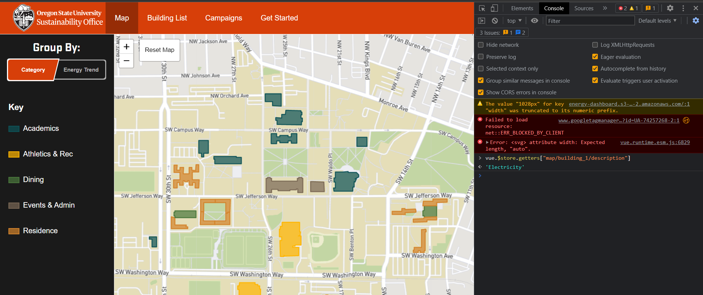

# Frontend Pre-Reqs

## Pre-Reqs to Install

### NPM

- NPM: [https://docs.npmjs.com/downloading-and-installing-node-js-and-npm](https://docs.npmjs.com/downloading-and-installing-node-js-and-npm)
  - You probably have this but just in case

### Yarn

We use Yarn for this wiki. Run this _after_ you have set up npm. You may have to re-run this if you switch NodeJS versions with NVM as listed below.

- `npm install --global yarn`
- https://classic.yarnpkg.com/lang/en/docs/install/#windows-stable

### NVM / NodeJS

- Node Version Manager (nvm):
  - This isn’t required but I highly recommend it (very annoying to switch NodeJS versions otherwise).
  - **This one is for Apple / Linux**: [https://github.com/nvm-sh/nvm](https://github.com/nvm-sh/nvm)
  - **Use this one for Windows**: [https://github.com/coreybutler/nvm-windows](https://github.com/coreybutler/nvm-windows)
    - Make sure to uninstall existing Node installation just in case: [https://github.com/coreybutler/nvm-windows#installation--upgrades](https://github.com/coreybutler/nvm-windows#installation--upgrades)
    - Read instructions in the repo README for general tips on installing specific node versions.
  - Use Node 18 ( `nvm use 18 `)

### Browser Debug Tools

- Inspect Element (right click > inspect in Chrome or Firefox)
- Vue Browser Debug Tools: [https://chrome.google.com/webstore/detail/vuejs-devtools/nhdogjmejiglipccpnnnanhbledajbpd?hl=en](https://chrome.google.com/webstore/detail/vuejs-devtools/nhdogjmejiglipccpnnnanhbledajbpd?hl=en)
  - Allows you to debug vue store in browser, e.g. `vue.$store.getters["map/building_1/description"]`
  - 

### IDE

- IDE: Use any you like, VSCode is a personal favorite of mine.
  - For VSCode install appropriate extensions for Vue, Javascript, etc

## Running the Frontend

- If you are either an open source contributor without access to local backend, or you are fixing a frontend-only issue (our production API backend is much faster):
  - Open both of these files in your IDE:
    - `.env.development`
    - `.env.production`
  - Change `VUE_APP_ROOT_API` in `.env.development` to match `.env.production`.
